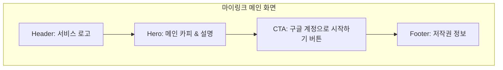

# [Wireframe] 마이링크 (MyLink) - 메인 화면

이 문서는 "마이링크" 서비스의 메인 랜딩 페이지 구조를 정의합니다. 불필요한 요소를 배제하고 구글 로그인을 통한 빠른 시작에 집중합니다.

---

## 1. 메인 화면 레이아웃 (Mermaid)



---

## 2. 아스키아트 와이어프레임 (ASCII Art)

```text
+-------------------------------------------------------------+
|                                                             |
|   [ MyLink ]                                                |  <-- 헤더 (Logo)
|                                                             |
+-------------------------------------------------------------+
|                                                             |
|                                                             |
|                                                             |
|             나의 모든 링크를 하나의 페이지로                |  <-- 메인 카피 (Hero Headline)
|                                                             |
|             "마이링크"로 당신을 표현하세요.                 |  <-- 서비스 설명 (Sub-headline)
|                                                             |
|                                                             |
|                                                             |
|                +---------------------------+                |
|                |  (G) 구글 계정으로 시작하기 |                |  <-- 메인 CTA (Google Login)
|                +---------------------------+                |
|                                                             |
|                                                             |
|             복잡한 가입 없이 바로 시작하세요.               |
|                                                             |
|                                                             |
|                                                             |
+-------------------------------------------------------------+
|                                                             |
|  (c) 2026 MyLink. All rights reserved.                      |  <-- 푸터 (Footer)
|                                                             |
+-------------------------------------------------------------+
```

---

## 3. 화면 구성 요소 상세 설명

### 3.1 헤더 (Header)
- **로고**: 서비스명 'MyLink'를 텍스트 또는 심플한 로고로 좌측 상단에 배치.
- 전체적으로 여백을 많이 두어 깔끔한 인상을 전달.

### 3.2 히어로 섹션 (Hero Section)
- **메인 카피**: 서비스의 핵심 가치를 한 문장으로 전달 ("나의 모든 링크를 하나의 페이지로").
- **서브 카피**: 부가적인 설명 제공.

### 3.3 CTA (Call To Action)
- **구글 로그인 버튼**: 화면 중앙에 가장 눈에 띄는 크기와 색상으로 배치.
- 구글 로고를 포함하여 사용자에게 익숙하고 안전한 느낌을 제공.
- 클릭 시 즉시 구글 OAuth 인증 절차 시작.

### 3.4 푸터 (Footer)
- 저작권 정보 및 필요한 경우 서비스 이용약관/개인정보 처리방침 링크 포함.
