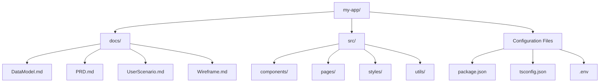
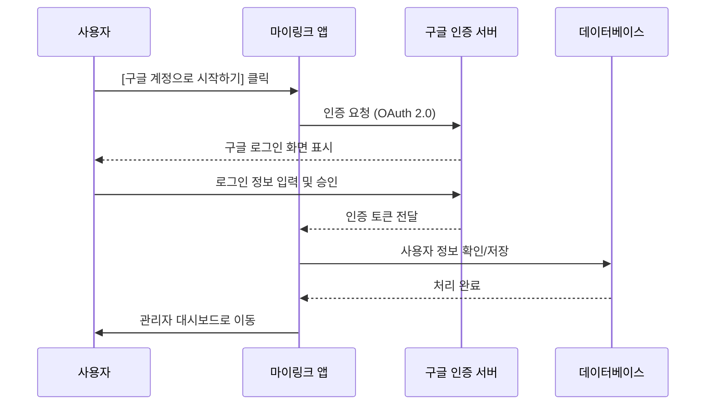

# [Wireframe] 마이링크 (MyLink) - 화면 및 구조 정의

이 문서는 "마이링크" 서비스의 주요 화면 상태(가입 전/중/후)와 프로젝트의 전체 구조를 정의합니다.

---

## 1. 프로젝트 구조도 (Mermaid)



---

## 2. 서비스 상태별 와이어프레임

### 2.1 가입 전 (Landing Page)
- **목적**: 서비스 소개 및 구글 로그인 유도

```text
+-------------------------------------------------------------+
|   [ MyLink ]                                                |
+-------------------------------------------------------------+
|                                                             |
|             나의 모든 링크를 하나의 페이지로                |
|             "마이링크"로 당신을 표현하세요.                 |
|                                                             |
|                +---------------------------+                |
|                |  (G) 구글 계정으로 시작하기 |                |
|                +---------------------------+                |
|                                                             |
|             복잡한 가입 없이 바로 시작하세요.               |
|                                                             |
+-------------------------------------------------------------+
|  (c) 2026 MyLink. All rights reserved.                      |
+-------------------------------------------------------------+
```

### 2.2 가입 중 (Sign-up/Login Flow)
- **목적**: 구글 OAuth를 통한 인증 및 초기 설정



### 2.3 가입 후 (Admin Dashboard - 링크 관리)
- **목적**: 자신의 링크 목록을 관리 (추가/수정/삭제)

```text
+-------------------------------------------------------------+
|   [ MyLink ]                       [ 내 페이지 보기 ] [로그아웃] |
+-------------------------------------------------------------+
|                                                             |
|  [ 프로필 설정 ]                                             |
|  ( ) 이미지 업로드                                           |
|  이름: [ 사용자 이름          ]                              |
|                                                             |
+-------------------------------------------------------------+
|  [ 링크 관리 ]                                               |
|                                                             |
|  +-------------------------------------------------------+  |
|  | [Icon] 내 인스타그램      | https://instagr.am/... [삭제] |  |
|  +-------------------------------------------------------+  |
|  | [Icon] 나의 포트폴리오    | https://my-work.com    [삭제] |  |
|  +-------------------------------------------------------+  |
|                                                             |
|  + 제목: [ 제목 입력       ]  URL: [ https://...      ]      |
|  [ + 새 링크 추가하기 ]                                      |
|                                                             |
+-------------------------------------------------------------+
```

---

## 3. 화면 구성 요소 상세 설명

### 3.1 가입 전 (Landing)
- **CTA 버튼**: 구글 로그인 버튼을 중앙에 배치하여 이탈률을 최소화함.

### 3.2 가입 중 (Auth Flow)
- **OAuth 2.0**: 사용자에게 별도의 비밀번호 입력을 요구하지 않고 보안성을 확보함.

### 3.3 가입 후 (Dashboard)
- **링크 리스트**: 현재 등록된 링크들을 리스트 형태로 보여주며, 구글 파비콘 API를 통해 아이콘을 자동 표시함.
- **실시간 미리보기 (옵션)**: 우측 또는 하단에 실제 방문자가 보게 될 화면을 미리 보여주는 기능을 고려할 수 있음.
